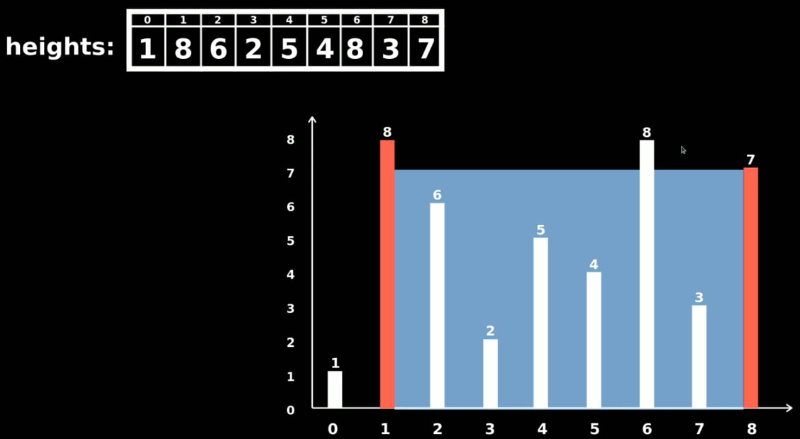

# Problem Description
Given n non-negative integers where each integer represent the height of a vertical line on a chart

 

find tow lines which toghther with x-axis forms a container that, holds the biggest amount of water
return the arean of that water

## examples
### input: 	5 3 2 1 4
### ans:	5 & 4
______________

### input: 1 8 6 2 5 4 8 3 7
### ans: 8 & 7